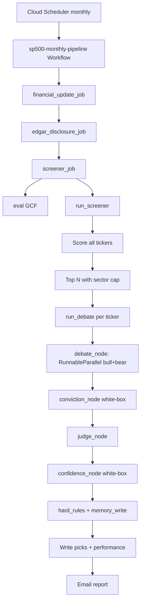

# Open-Source Core Screener — Refined Implementation Plan

## Context

Extract and rebuild the private `sp500-screener-agent` as a new public repo. The goal is to preserve the core concept (Bull/Bear/Judge agents, episodic memory, EDGAR RAG, eval pipeline) while:
- Removing all proprietary infra coupling (6 named Firestore DBs → 1, Flask HTTP server → Cloud Run Job)
- Making LLM provider swappable via `init_chat_model("provider:model")` — no custom provider implementations
- Giving users full ownership of all secrets and config
- Creating a clean schema designed from scratch (subcollections for high-cardinality data, unified pick ledger)

This is a **new repo** — not a migration of the existing one. Logic is preserved; interfaces are rewritten.

---

## Critical Corrections from Codebase Review

Before detailing the plan, these deviations from the draft require attention:

1. **`eval_metrics.py` lives in `screener/metrics/`**, not `screener/lib/`. Same for `eval_scorer.py`, `eval_rubric.py`. The critical files table must reflect `screener/metrics/eval_metrics.py`.

2. **`Send()` is wrong for fixed parallel Bull/Bear.** LangGraph's `Send()` is for dynamic fan-out over a list (map-reduce). For two fixed agents, use `RunnableParallel(bull=bull_chain, bear=bear_chain)` inside a single `debate_node`. This is simpler and correct.

3. **Eval GCF is NOT unchanged.** Currently it calls `get_performance_db()` and `get_eval_db()` from `firestore_io.py`. With the new storage abstraction, it must use `get_storage()` instead. Logic is preserved; storage calls are adapted.

4. **`run_screener()` must become the full pipeline coordinator.** Currently, `screener/main.py:run_screener()` only scores tickers. The analysis loop (run_debate per ticker), performance tracking, and email are driven by `server.py:run_weekly()`. In the new repo with no `server.py`, `screener/main.py:run_screener()` (renamed `run_monthly_screener()` or just `run_screener()`) must own the entire monthly pipeline end-to-end: score → analyze top N → write picks → email report.

5. **`sp500_ticker_signals` is NOT redundant with `screenings.all_scored`.** It's read by the pending GCF to feed on-demand analysis. Since the pending GCF and Firestore event bus are removed from the open-source version, this collection is simply eliminated — not merged.

6. **Token usage tracking.** LangChain's `.with_structured_output()` returns the Pydantic model directly. `model_used`/`tokens_used` fields on `ScoreResult` must be populated via a LangChain callback handler (e.g., `langchain_core.callbacks.UsageMetadataCallbackHandler`) or dropped from eval scoring. Mark as optional with graceful degrade.

---

## New Repo Structure

```
stock-screener/
├── config/
│   ├── config.yaml          # All tunables: LLM, signals, notifications, storage
│   ├── tickers.yaml         # Stock universe (S&P 500 default)
│   └── .env.example         # All required secrets, commented
├── screener/
│   ├── agents/
│   │   ├── graph.py         # LangGraph StateGraph: debate_node → conviction → judge → confidence → hard_rules → memory_write
│   │   ├── nodes.py         # Node functions (debate_node uses RunnableParallel, judge_node, conviction_node, etc.)
│   │   ├── state.py         # DebateState TypedDict
│   │   ├── prompts.py       # System prompts (same content as current prompts.py, no module-level sentinel imports)
│   │   └── news_agent.py    # News sentiment pipeline (DuckDuckGo → LLM)
│   ├── metrics/
│   │   ├── technical.py
│   │   ├── earnings_yield.py
│   │   ├── fcf_yield.py
│   │   ├── ebitda_ev.py
│   │   ├── normalizer.py     # (moved from screener/lib/normalizer.py)
│   │   ├── confidence_scorer.py
│   │   ├── conviction_scorer.py
│   │   ├── eval_scorer.py
│   │   ├── eval_rubric.py
│   │   └── performance.py
│   ├── edgar/
│   │   ├── fetcher.py
│   │   ├── embedder.py
│   │   └── retriever.py
│   ├── lib/
│   │   ├── config.py        # Pydantic Settings loader (config.yaml + .env)
│   │   ├── models.py        # Pydantic output models (BullCaseOutput, JudgeOutput, etc.)
│   │   ├── eval_metrics.py  # Aggregate accuracy, bias, calibration
│   │   ├── storage/
│   │   │   ├── base.py      # Abstract StorageClient interface
│   │   │   ├── firestore.py # Firestore implementation (single named DB)
│   │   │   ├── s3.py        # JSON-over-S3 (brute-force vector for EDGAR)
│   │   │   └── opensearch.py
│   │   └── email_sender.py
│   └── main.py              # run_screener() — full pipeline: score → analyze top N → email → performance
├── jobs/
│   ├── screener/
│   │   └── main.py          # Cloud Run Job entry point: calls run_screener(), sys.exit(0)
│   ├── financial_update/
│   │   └── main.py          # Logic preserved, storage calls adapted to StorageClient
│   └── edgar_disclosure/
│       └── main.py          # Logic preserved, storage calls adapted to StorageClient
├── gcf/
│   └── eval/
│       └── main.py          # Logic preserved, storage calls adapted to StorageClient
├── docker/
│   ├── Dockerfile.screener
│   ├── Dockerfile.financial_update
│   └── Dockerfile.edgar_disclosure
├── deploy/
│   ├── setup_gcp.sh
│   ├── deploy_all.sh
│   └── workflows/
│       └── monthly_pipeline.yaml  # 4-step: financial_update → edgar_disclosure → weekly_screener → eval GCF
├── tests/
├── AGENT.md                 # Principal engineer overview (≤200 lines)
├── requirements.txt
└── README.md
```

**Deleted vs current repo:**
- `server.py` — replaced by `jobs/screener/main.py`
- `screener/agents/llm/providers/` — replaced by `init_chat_model`
- `screener/agents/llm/llm_client.py` — replaced by `init_chat_model`
- `screener/lib/firestore_io.py` — replaced by `screener/lib/storage/`
- `screener/lib/sp500_tickers.py` — replaced by `config/tickers.yaml` loading in `screener/lib/config.py`
- `gcf/tickers/main.py` — tickers are static config, not auto-updated
- `gcf/pending/main.py` — Firestore event bus / tickrly integration removed
- `config/weights.yaml`, `config/notify.yaml` — merged into `config/config.yaml`

---

## Execution Flow (New vs Old)

```
OLD:  Cloud Scheduler → POST /run_monthly (Flask)
                         └→ triggers GCF tickers → financial_update job → edgar_disclosure job
                         └→ POST /run_weekly (Flask) [analysis + email + picks]
                              └→ screener/main.py:run_screener() [scoring only]

NEW:  Cloud Scheduler → sp500-monthly-pipeline (Cloud Workflows)
        Step 1: financial_update_job  (Cloud Run Job)
        Step 2: edgar_disclosure_job  (Cloud Run Job)
        Step 3: screener_job          (Cloud Run Job)
                └→ jobs/screener/main.py
                   └→ screener/main.py:run_screener()  [score + analyze + email + picks, end-to-end]
        Step 4: eval GCF              (POST trigger — score prior month picks, write to eval collection)
                └→ gcf/eval/main.py   [reads picks/, writes runs/{MONTH_ID}]
```



---

## LLM Provider System

Replace `screener/agents/llm/providers/` + `llm_client.py` with LangChain `init_chat_model`.

```python
# screener/agents/nodes.py
from langchain.chat_models import init_chat_model
from screener.lib.config import get_config

def _get_model(override: str | None = None):
    cfg = get_config()
    return init_chat_model(override or cfg.llm.model)

# Parallel Bull + Bear inside a single debate_node (RunnableParallel, NOT Send())
def debate_node(state: DebateState) -> DebateState:
    cfg = get_config()
    bull_model = _get_model(cfg.llm.bull_model).with_structured_output(BullCaseOutput)
    bear_model = _get_model(cfg.llm.bear_model).with_structured_output(BearCaseOutput)
    context = state["context"]
    parallel = RunnableParallel(
        bull=bull_model,
        bear=bear_model,
    )
    result = parallel.invoke({"bull": context, "bear": context})
    return {**state, "bull_output": result["bull"], "bear_output": result["bear"]}
```

**`RunnableParallel` not `Send()`**: Bull and Bear always run as exactly 2 fixed agents — `RunnableParallel` is correct and simpler. `Send()` is for dynamic fan-out over a variable-length list.

**Token tracking**: LangChain abstracts the response object. Populate `model_used` in `ScoreResult` from `get_config().llm.model`. For `tokens_used`, use `UsageMetadataCallbackHandler` from `langchain_core` or mark the field optional with empty dict default. Do not try to reconstruct from raw API responses.

---

## LangGraph State and Graph Shape

```python
# screener/agents/state.py
class DebateState(TypedDict):
    ticker: str
    ticker_name: str
    signals: dict
    news_sentiment: NewsSentimentOutput
    disclosure_block: Optional[str]
    prior_memory: Optional[list[dict]]
    scoring_weights: Optional[dict]
    eval_context: Optional[dict]
    context: str                          # assembled by build_context_node
    bull_output: Optional[BullCaseOutput]
    bear_output: Optional[BearCaseOutput]
    bull_conviction: Optional[float]
    bear_conviction: Optional[float]
    judge_output: Optional[JudgeOutput]
    confidence_score: Optional[float]
    contested_truth: Optional[bool]
    final_action: Optional[str]
```

```
Graph: START → memory_read → build_context → debate_node (RunnableParallel bull+bear)
             → conviction_node → judge_node → confidence_node → hard_rules → memory_write → END
```

All nodes except `debate_node` are single-chain. `debate_node` uses `RunnableParallel` internally. The LangGraph graph is linear from the state machine's perspective — only the internals of `debate_node` are parallel.

---

## Storage Abstraction

### Abstract Interface (`screener/lib/storage/base.py`)

```python
class StorageClient(ABC):
    def read(self, collection: str, doc_id: str) -> dict | None: ...
    def write(self, collection: str, doc_id: str, data: dict) -> None: ...    # create-only, raises if exists
    def upsert(self, collection: str, doc_id: str, data: dict) -> None: ...  # merge
    def query(self, collection: str, filters: list[tuple]) -> list[dict]: ...
    def read_subcollection(self, collection: str, doc_id: str, sub: str) -> list[dict]: ...
    def write_subcollection(self, collection: str, doc_id: str, sub: str, sub_id: str, data: dict) -> None: ...
    def vector_query(self, collection: str, embedding: list[float], filters: list[tuple], k: int) -> list[dict]: ...
```

`write()` is **idempotent-create** — raises `AlreadyExists` if doc exists, matching current `doc.create()` semantics. S3 implementation checks key existence before write.

**Factory**: `screener/lib/storage/__init__.py:get_storage() -> StorageClient` reads `config.storage.provider`.

**S3 vector_query**: brute-force cosine over loaded docs. ~10k EDGAR chunks (500 tickers × 20 chunks) fits in memory; acceptable for open-source scale.

### Single Database Schema

All collections in one named Firestore DB: `multi-agent-stock-screener`.  
All run-keyed IDs use `MONTH_ID` format: `2026-04`.

| Collection | Example Doc ID | Notes |
|-----------|----------------|-------|
| `tickers/{SYMBOL}` | `AAPL` | master record + subcollections |
| `tickers/{SYMBOL}/memory/{MONTH_ID}` | `AAPL/memory/2026-04` | per-run verdict; replaces flat `weeks` map |
| `tickers/{SYMBOL}/scoring_weights/current` | `AAPL/scoring_weights/current` | adaptive bull/bear weights |
| `screenings/{MONTH_ID}` | `2026-04` | monthly screening result (top N + all scored) |
| `analysis/{TICKER}_{MONTH_ID}` | `AAPL_2026-04` | cached debate output; skip if exists (idempotent) |
| `signals/{TICKER}_{MONTH_ID}` | `AAPL_2026-04` | quarterly fundamentals written by financial_update job |
| `picks/{TICKER}_{MONTH_ID}_{source}` | `AAPL_2026-04_judge` | unified ledger; source = `screener` or `judge` |
| `performance/{MONTH_ID}_{source}` | `2026-04_judge` | win rate, alpha, bull/bear accuracy per run |
| `chunks/{DOC_ID}` | `sha256-hash` | EDGAR vector chunks (Firestore vector index: cosine, dim 3072, ticker pre-filter) |
| `eval/{MONTH_ID}` | `2026-04` | monthly eval report: accuracy, bull/bear accuracy, bias, calibration, sector concentration, acid test by confidence tier — **written by eval GCF; read next month and injected as `eval_context` into Judge prompt (feedback loop)** |
| `events/{ID}` | `uuid` | typed event log |

**Eliminated collections:**
- `sp500_ticker_signals` — fed pending GCF; pending GCF is removed
- `screener_picks` — redundant with `screenings.top_10`
- `ticker_memory` (flat doc) — replaced by `tickers/{SYMBOL}/memory/` subcollection
- `judge_pick_ledger` summary — replaced by individual `picks/` docs
- `screener_performance`, `perf_snapshots`, `judge_perf_snapshots` — merged into `performance/` with `source` field

---

## Config System

### `config/config.yaml`
```yaml
llm:
  model: "anthropic:claude-haiku-4-5-20251001"
  bull_model: null        # falls back to llm.model if null
  bear_model: null
  judge_model: null
  news_model: null
  narrator_model: "google_genai:gemini-2.0-flash"
  embedder_model: "google_genai:models/gemini-embedding-001"

screener:
  tickers_file: config/tickers.yaml
  top_n: 10
  max_sector_picks: 3

signals:
  weights:
    technical: 0.20
    earnings: 0.30
    fcf: 0.30
    ebitda: 0.20
  confidence_scoring:
    w1_margin: 0.40
    w2_unique_sources: 0.35
    w3_hedge: 0.25

edgar:
  enabled: true
  chunk_size: 512
  overlap: 0.1
  freshness_days: 30
  forms: ["10-K", "10-Q"]
  lookback_years: 2

notifications:
  email:
    recipients: []
    from: ""

storage:
  provider: firestore
  database: multi-agent-stock-screener
  gcp_project: ""
  gcp_region: "us-west1"
  s3_bucket: ""
  s3_prefix: "multi-agent-stock-screener/"
  opensearch_host: ""
```

`screener/lib/config.py` uses `pydantic-settings`: reads `config.yaml` for tunables, `.env` / env vars for secrets. No GCP Secret Manager client in application code.

---

## Monthly Pipeline

```
sp500-monthly-pipeline (Cloud Workflows):
  Step 1: financial_update_job (Cloud Run Job, polled via v2 Operation API)
  Step 2: edgar_disclosure_job (Cloud Run Job, polled via v2 Operation API)
  Step 3: screener_job         (Cloud Run Job, polled — score + analyze + email + picks)
  Step 4: eval GCF             (POST trigger — monthly decision quality eval)
```

All orchestration in one file: `deploy/workflows/monthly_pipeline.yaml`. Cloud Scheduler triggers this workflow once per month. There is no separate weekly schedule.

---

## Critical Files: Carry Logic, Rewrite Interface

| Current | New | Change |
|---------|-----|--------|
| `screener/agents/llm/orchestrator.py` | `screener/agents/graph.py` + `nodes.py` | LangGraph; same scoring/memory logic |
| `screener/agents/llm/providers/claude.py` + `ollama.py` | deleted | replaced by `init_chat_model` |
| `screener/agents/llm/llm_client.py` | deleted | replaced by `init_chat_model` |
| `screener/agents/llm/models.py` | `screener/lib/models.py` | moved; BullCaseOutput, BearCaseOutput, JudgeOutput unchanged |
| `screener/lib/firestore_io.py` | `screener/lib/storage/` | abstract DAO + implementations |
| `screener/lib/sp500_tickers.py` | deleted | config/tickers.yaml loaded by config.py |
| `server.py` | deleted | screener is now a Job |
| `gcf/tickers/main.py` | deleted | tickers are static config |
| `gcf/pending/main.py` | deleted | event bus / tickrly removed |
| `config/weights.yaml` + `config/notify.yaml` | merged into `config/config.yaml` | single config file |
| `screener/agents/llm/prompts.py` | `screener/agents/prompts.py` | same prompts, no SCORING_MIN_SAMPLE sentinel import |
| `screener/metrics/confidence_scorer.py` | unchanged (logic + location) | — |
| `screener/metrics/conviction_scorer.py` | unchanged (logic + location) | — |
| `screener/metrics/eval_scorer.py` | unchanged (logic + location) | optional token tracking |
| `screener/metrics/eval_metrics.py` | `screener/lib/eval_metrics.py` | moved to lib |
| `screener/lib/normalizer.py` | `screener/metrics/normalizer.py` | moved to metrics |
| `screener/edgar/` | `screener/edgar/` | unchanged |
| `gcf/eval/main.py` | `gcf/eval/main.py` | logic preserved; Firestore calls → `get_storage()`; writes to `eval/{MONTH_ID}` |
| `jobs/financial_update/main.py` | `jobs/financial_update/main.py` | logic preserved; Firestore calls → `get_storage()` |
| `jobs/edgar_disclosure/main.py` | `jobs/edgar_disclosure/main.py` | logic preserved; Firestore calls → `get_storage()` |
| `jobs/screener/main.py` | **NEW** | 5-line Cloud Run Job entry point |

---

## Key Dependencies

```
langchain>=0.3
langgraph>=0.2
langchain-anthropic        # anthropic: prefix
langchain-google-genai     # google_genai: prefix
langchain-openai           # openai: prefix (optional)
langchain-ollama           # ollama: prefix (optional)
pydantic-settings>=2.0

# Removed:
# anthropic  (now via langchain-anthropic)
# flask      (server.py deleted)
```

---

## Verification Plan

1. **LangGraph smoke test**: `python -c "from screener.agents.graph import build_debate_graph; g = build_debate_graph(); print(g.get_graph().draw_ascii())"` — asserts the state machine compiles and has the expected nodes.

2. **Model swap test**: Set `llm.model: "ollama:mistral"` in config.yaml, run a single ticker debate end-to-end with mocked signals and storage — asserts `init_chat_model` dispatches correctly.

3. **Storage swap test**: Set `storage.provider: s3`, run a screening with mock signals — asserts docs written under correct S3 paths and the weekly cache skip logic works.

4. **Screener Job**: `python jobs/screener/main.py --dry-run` — asserts `screenings/{DATE}` doc is created and the job exits 0.

5. **Port unit tests**: Rewrite `tests/test_orchestrator.py` against `graph.py`; rewrite `tests/test_firestore_io.py` against `StorageClient` implementations. All other metric/scorer/edgar tests port directly.

6. **Monthly pipeline integration**: Trigger `sp500-monthly-pipeline` in Cloud Workflows; assert 4-step sequence completes in order (financial_update → edgar_disclosure → screener → eval GCF).
